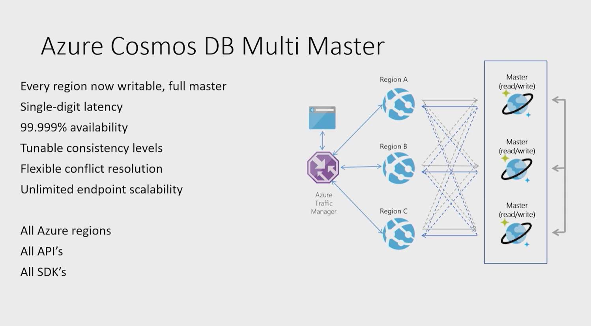

# Configuring Azure Cosmos DB Multi-Master Writes via SDK
SDK samples for setting up Azure Cosmos DB - Multi-Master Write Regions across 5 available APIs in one location.

[About Azure Cosmos DB](#about-azure-cosmos-db) 

[Core SQL API](#core-sql-api)

[Mongo DB API](#mongo-db-api)

[Cassandra DB API](#cassandra-db-api)

[Gremlin API](#gremlin-api)

[Table API](#table-api)

[Feedback](#feedback)

[License/Terms of Use](#license--terms-of-use)

## About Azure Cosmos DB
Azure Cosmos DB is a fully managed NoSQL database for modern app development, with SLA-backed speed and availability, automatic and instant scalability, and open-source APIs for MongoDB, Cassandra, and other NoSQL engines. For a more in-depth coverage of Azure Cosmos DB, you should visit the official site here > https://docs.microsoft.com/en-us/azure/cosmos-db/introduction



Prior to the capability of assigning 'Multi-Master', if you had multiple regions defined, all your 'Writes' would have always gone to the region which is assigned, 'Write Region', and all 'Reads' could come from the nearest Replica Regions. With Multi-Master now, every Replica Region that you setup is a Full-Master, so you can write to that region as well; and get the same latency as if you were in the same region as the Master. This means:
- Available for all 5 APIs: Core SQL, MongoDB, Cassandra, Table & Gremlin APIs
- We get single-digit latencies for 'Reads' & 'Writes'
- 5 9s of availability
- 5 Consistency Levels that you could fine-tune based on your application end-user needs
- Ultimate end-point scalability
- And finally, flexible conflict handling & resolution policies.

## Core SQL API
Once an account has been created with multiple write regions enabled, you must make two changes in your application to the ```ConnectionPolicy``` for the Cosmos client to enable the multi-region writes in Azure Cosmos DB. Within the ```ConnectionPolicy```, set ```UseMultipleWriteLocations``` to **true** and pass the name of the region where the application is deployed to ```ApplicationRegion```. This will populate the ```PreferredLocations``` property based on the geo-proximity from location passed in. If a new region is later added to the account, the application does not have to be updated or redeployed, it will automatically detect the closer region and will auto-home on to it should a regional event occur.

1) **.NET SDK v2**: To enable multi-region writes in your application, set UseMultipleWriteLocations to true. Also, set SetCurrentLocation to the region in which the application is being deployed and where Azure Cosmos DB is replicated:

```
ConnectionPolicy policy = new ConnectionPolicy
    {
        ConnectionMode = ConnectionMode.Direct,
        ConnectionProtocol = Protocol.Tcp,
        **UseMultipleWriteLocations = true**
    };
policy.SetCurrentLocation("West US 2");
```
2) **.NET SDK v3**: To enable multi-region writes in your application, set ApplicationRegion to the region in which the application is being deployed and where Cosmos DB is replicated:

```
CosmosClient cosmosClient = new CosmosClient("<connection-string-from-portal>", new CosmosClientOptions() { ApplicationRegion = Regions.WestUS2, });
```

3) **Java SDK V4** (Async): To enable multi-region writes in your application, call .multipleWriteRegionsEnabled(true) and .preferredRegions(preferredRegions) in the client builder, where preferredRegions is a List containing one element - that is the region in which the application is being deployed and where Cosmos DB is replicated:

```
ArrayList<String> preferredRegions = new ArrayList<String>();
preferredRegions.add(region);

CosmosAsyncClient client =
        new CosmosClientBuilder()
                .endpoint(HOST)
                .key(MASTER_KEY)
                .multipleWriteRegionsEnabled(true)
                .preferredRegions(preferredRegions)
                .buildAsyncClient();
```                

4) **Java SDK V4** (Sync): 

```
ArrayList<String> preferredRegions = new ArrayList<String>();
preferredRegions.add(region);

CosmosClient client =
        new CosmosClientBuilder()
                .endpoint(HOST)
                .key(MASTER_KEY)
                .multipleWriteRegionsEnabled(true)
                .preferredRegions(preferredRegions)
                .buildClient();
```      

## Mongo DB API
GitHub sample demonstrating multi-master scenarios using Azure Cosmos DB for MongoDB API: [click here](https://github.com/Azure-Samples/azure-cosmos-db-mongodb-dotnet-multi-master).

```
//------------------------------------------------------------
// Copyright (c) Microsoft Corporation.  All rights reserved.
//------------------------------------------------------------
namespace Microsoft.Azure.Cosmos.Samples
{
    using System;
    using System.Linq;
    using MongoDB.Driver;

    /// <summary>
    /// Helpers to leverage Cosmos DB multi-master capabilities using the Azure Cosmos DB for MongoDB API
    /// </summary>
    public static class Helpers
    {
        /// <summary>
        /// Retrieve a MongoClient with a preferred write region set.
        /// When connected to a multi-master enabled Cosmos DB database account,
        /// the preferred write region will be considered when determining which
        /// region to report to the client as the PRIMARY.
        /// </summary>
        /// <param name="mongoClientSettings">The MongoClientSettings used to instantiate the client.</param>
        /// <param name="preferredWriteRegion">The preferred write region</param>
        /// <returns>A MongoClient with the preferred write region set</returns>
        public static MongoClient GetMongoClientWithPreferredWriteRegion(MongoClientSettings mongoClientSettings, string preferredWriteRegion)
        {
            mongoClientSettings = mongoClientSettings.Clone();

            if (mongoClientSettings.Servers.Any(x => x.Port != 10255))
            {
                throw new ArgumentException("For geo-replication scenarios, the initial port in connection string should be 10255.");
            }

            if (!string.IsNullOrEmpty(preferredWriteRegion))
            {
                // Setting the preferred write region is done by appending it to the application name
                // The server will attempt to parse the string after the last '@' as an Azure region
                // If the parse is successful, the writeable region geographically closest to the
                // preferred write region will be presented to the MongoClient as the PRIMARY
                mongoClientSettings.ApplicationName = mongoClientSettings.ApplicationName + $"@{preferredWriteRegion}";
            }

            return new MongoClient(mongoClientSettings);
        }

        /// <summary>
        /// Cosmos DB returns the region for a given endpoint in the TagSet
        /// This can be useful as part of a workflow to switch the PRIMARY to a different region.
        /// </summary>
        public static string TryGetRegionFromTags(TagSet tagSet)
        {
            return tagSet?.Tags?.FirstOrDefault(x => string.Equals("region", x.Name, StringComparison.Ordinal))?.Value;
        }
    }
}
```

2 points to note:
1)	The above code helps us in determining the nearest **Write Region**.
2)	The nearest **Write Region** is also set as the **Read Region**. Note that if the nearest region is the WRITE region, then these operations are directed to that region as explained in link below for geo-replicated ‘Reads’.

Another key point is – you can explicitly also globally distribute the “reads”. That is explained [here in this official documentation](https://docs.microsoft.com/en-us/azure/cosmos-db/mongodb/readpreference-global-distribution).

MongoDB protocol provides the following Read Preference modes for clients to use:
1. PRIMARY
2. PRIMARY_PREFERRED
3. SECONDARY
4. SECONDARY_PREFERRED
5. NEAREST

Refer to the detailed MongoDB Read Preference behavior documentation for details on the behavior of each of these read preference modes. In Cosmos DB, primary maps to WRITE region and secondary maps to READ region.

Based on common scenarios, we recommend using the following settings:

- If low latency reads are required, use the NEAREST read preference mode. This setting directs the read operations to the nearest available region. Note that if the nearest region is the WRITE region, then these operations are directed to that region.
- If high availability and geo distribution of reads are required (latency is not a constraint), then use the PRIMARY PREFERRED or SECONDARY PREFERRED read preference mode. This setting directs read operations to an available WRITE or READ region respectively. If the region is not available, then requests are directed to the next available region as per the read preference behavior.

## Cassandra DB API
You will need to implement Azure Cosmos DB extension for Cassandra API for the Java v4 Datastax Apache Cassandra OSS Driver. Access GitHub project [here](https://github.com/Azure-Samples/azure-cosmos-cassandra-extensions-java-sample-v4).

```
        <dependency>
            <groupId>com.azure</groupId>
            <artifactId>azure-cosmos-cassandra-driver-4-extensions</artifactId>
            <version>1.1.0</version>
        </dependency>
```

In application.conf, you can mention:

```
  basic {   
    contact-points = [${AZURE_COSMOS_CASSANDRA_GLOBAL_ENDPOINT}]    
    load-balancing-policy {
      # Global endpoint for connecting to Cassandra
      #
      #   When global-endpoint is specified, you may specify a read-datacenter, but must not specify a write-datacenter.
      #   Writes will go to the default write region when global-endpoint is specified.
      #
      #   When global-endpoint is not specified, you must specify values for read-datacenter, write-datacenter, and
      #   datastax-java-driver.basic.contact-points.
      #
      #   Set the variables referenced here to match the topology and preferences for your
      #   Cosmos DB Cassandra API instance.
      global-endpoint = ""
      read-datacenter = "Australia East"
      write-datacenter = "UK South"
    }
  }
```

## Gremlin API
Cosmos DB Graph database engine is capable of running in multiple regions, each of which contains multiple clusters. Each cluster has hundreds of machines. Cosmos DB Graph account DNS CNAME accountname.gremlin.cosmos.azure.com resolves to DNS A record of a cluster. A single IP address of a load-balancer **hides** internal cluster topology.

A regional DNS CNAME record is created for every region of Cosmos DB Graph account. Format of regional endpoint is accountname-region.gremlin.cosmos.azure.com. Region segment of regional endpoint is obtained by removing all spaces from Azure region name. For example, "East US 2" region for "contoso" global database account would have a DNS CNAME contoso-eastus2.gremlin.cosmos.azure.com.

TinkerPop Gremlin client is designed to work with a **single server**. Application can use global writable DNS CNAME for read and write traffic. Region-aware applications should use regional endpoint for read traffic. Use regional endpoint for write traffic only if specific region is configured to accept writes.

Global database account CNAME always points to a valid write region. During server-side failover of write region, Cosmos DB updates global database account CNAME to point to new region. If application can't handle traffic rerouting after failover, it should use global database account DNS CNAME.

Example below demonstrates general principles of accessing regional Gremlin endpoint. Application should consider number of regions to send the traffic to and number of corresponding Gremlin clients to instantiate.

```
// Example value: Central US, West US and UK West. This can be found in the overview blade of you Azure Cosmos DB Gremlin Account. 
// Look for Write Locations in the overview blade. You can click to copy and paste.
string[] gremlinAccountRegions = new string[] {"Central US", "West US" ,"UK West"};
string gremlinAccountName = "PUT-COSMOSDB-ACCOUNT-NAME-HERE";
string gremlinAccountKey = "PUT-ACCOUNT-KEY-HERE";
string databaseName = "PUT-DATABASE-NAME-HERE";
string graphName = "PUT-GRAPH-NAME-HERE";

foreach (string gremlinAccountRegion in gremlinAccountRegions)
{
  // Convert preferred read location to the form "[acountname]-[region].gremlin.cosmos.azure.com".
  string regionalGremlinEndPoint = $"{gremlinAccountName}-{gremlinAccountRegion.ToLowerInvariant().Replace(" ", string.Empty)}.gremlin.cosmos.azure.com";

  GremlinServer regionalGremlinServer = new GremlinServer(
    hostname: regionalGremlinEndPoint, 
    port: 443,
    enableSsl: true,
    username: "/dbs/" + databaseName + "/colls/" + graphName,
    password: gremlinAccountKey);

  GremlinClient regionalGremlinClient = new GremlinClient(
    gremlinServer: regionalGremlinServer,
    graphSONReader: new GraphSON2Reader(),
    graphSONWriter: new GraphSON2Writer(),
    mimeType: GremlinClient.GraphSON2MimeType);
}
```

**SDK endpoint discovery**: Application can use Azure Cosmos DB SDK to discover read and write locations for Graph account. These locations can change at any time through manual reconfiguration on the server side or automatic failover. **TinkerPop Gremlin SDK doesn't have an API to discover Cosmos DB Graph database account regions. Applications that need runtime endpoint discovery need to host 2 separate SDKs in the process space**.

```
// Depending on the version and the language of the SDK (.NET vs Java vs Python)
// the API to get readLocations and writeLocations may vary.
IDocumentClient documentClient = new DocumentClient(
    new Uri(cosmosUrl),
    cosmosPrimaryKey,
    connectionPolicy,
    consistencyLevel);

DatabaseAccount databaseAccount = await cosmosClient.GetDatabaseAccountAsync();

IEnumerable<DatabaseAccountLocation> writeLocations = databaseAccount.WritableLocations;
IEnumerable<DatabaseAccountLocation> readLocations = databaseAccount.ReadableLocations;

// Pick write or read locations to construct regional endpoints for.
foreach (string location in readLocations)
{
  // Convert preferred read location to the form "[acountname]-[region].gremlin.cosmos.azure.com".
  string regionalGremlinEndPoint = location
    .Replace("http:\/\/", string.Empty)
    .Replace("documents.azure.com:443/", "gremlin.cosmos.azure.com");
  
  // Use code from the previous sample to instantiate Gremlin client.
}
```

## Table API
*To be filled in later*

## Feedback
You can share any feedback at: sugh AT microsoft dot com

## License & Terms of Use
This is a free white paper released into the public domain. Anyone is free to use or distribute this white paper, for any purpose, commercial or non-commercial, and by any means. Same applies to the code in the repo.

THE WHITE PAPER IS PROVIDED "AS IS", WITHOUT WARRANTY OF ANY KIND, EXPRESS OR IMPLIED, INCLUDING BUT NOT LIMITED TO THE WARRANTIES OF MERCHANTABILITY, FITNESS FOR A PARTICULAR PURPOSE AND NONINFRINGEMENT.

IN NO EVENT SHALL THE AUTHORS BE LIABLE FOR ANY CLAIM, DAMAGES OR OTHER LIABILITY, WHETHER IN AN ACTION OF CONTRACT, TORT OR OTHERWISE, ARISING FROM, OUT OF OR IN CONNECTION WITH THE WHITE PAPER.

Have fun!
